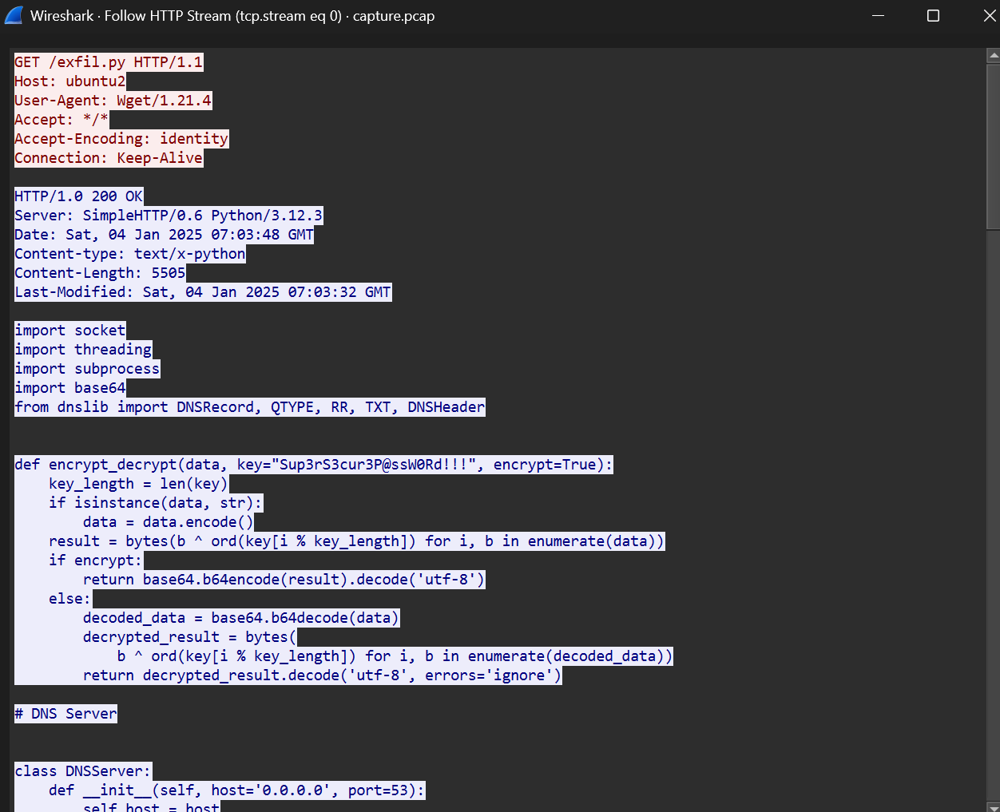
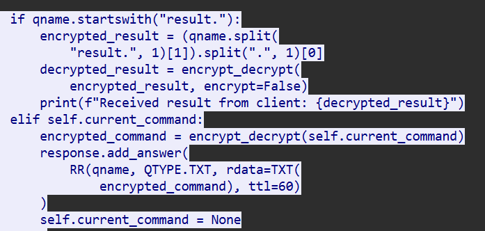
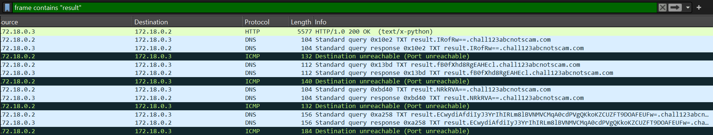

# [ WriteUp/Notes ] | Baby PCAP | Forensic - Cyber League 2025

## By: Haalloobim as [HCS](https://ctftime.org/team/70159)

## Description 
1. Desc: 
I want to be like the cool kids, so I got chatGPT to write me a custom DNS C2 framework!

2. Tools:
- Wireshark

3. File: 
- [capture.pcap](https://ctfd.cyberleague.co/files/92289fbfcf7cb6551d820286f606e9f6/capture.pcap?token=eyJ1c2VyX2lkIjo4NDMsInRlYW1faWQiOjQyOCwiZmlsZV9pZCI6MzY3fQ.Z4MsXQ.8th4-LyH43zsrt_QwhnuS6nEnu8)

## How to solve? 

#### ;tldr

1. We've been provided by pcap files
2. There is a tcp stream that have an exfiltration python script
    
3. In that script, there is a function that send and recieve a dns packet with encryption, and there is a format for the packet 
    
4. we search using filter `frame contains "result"`
    
5. And the last step is decrypt the packet to get the flag.
    ```py
    import base64

    def encrypt_decrypt(data, key="Sup3rS3cur3P@ssW0Rd!!!", encrypt=True):
        key_length = len(key)
        if isinstance(data, str):
            data = data.encode()
        result = bytes(b ^ ord(key[i % key_length]) for i, b in enumerate(data))
        if encrypt:
            return base64.b64encode(result).decode('utf-8')
        else:
            decoded_data = base64.b64decode(data)
            decrypted_result = bytes(
                b ^ ord(key[i % key_length]) for i, b in enumerate(decoded_data))
            return decrypted_result.decode('utf-8', errors='ignore')


    data1 = "result.ECwydiAfdiIyJ3YrIhIRLm8lBVNMVCMqA0cdPVgQKkoKZCUZFT9DOAFEUFw=.chall123abcnotscam.com".split(".")[1]

    print(encrypt_decrypt(data1, encrypt=False))
    ```

#### Flag: `CYBERLEAGUE{baby_warmup_stonks_894ejfhsjeeq}`