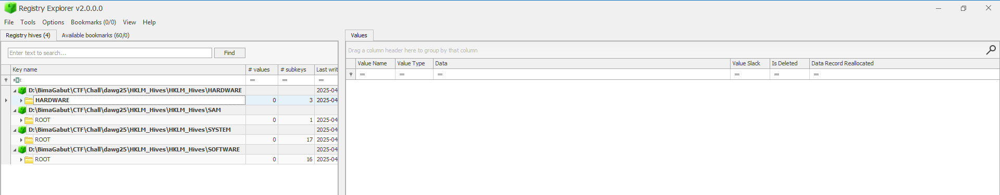
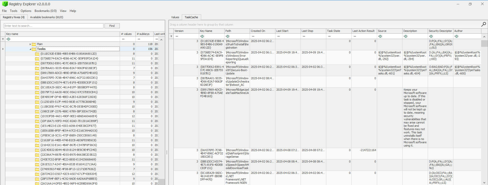
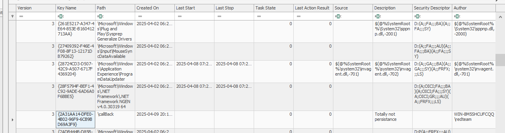
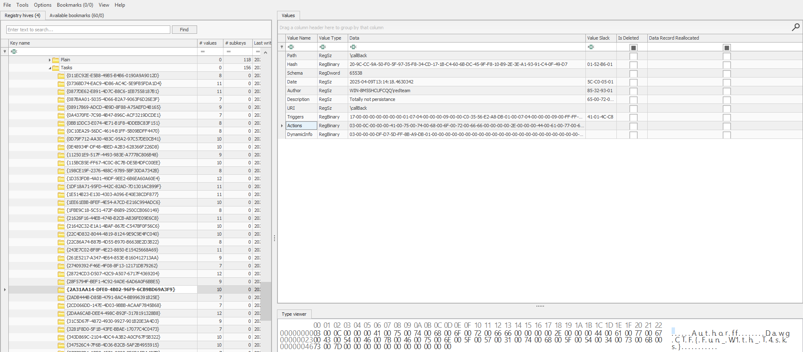

# [ WriteUp/Notes ] Keeping On Schedule | Forensic - Dawg CTF 2025

## By: Haaloobim as [HCS](https://ctftime.org/team/70159)

## Description 
1. Scenario: 
One of our computers on the company network had some malware on it. We think we cleared of the main payload however it came back. Can you check for any signs of persistence? We are able to provide you a copy of the registry, the sooner the better!  For any registry related challenges, make sure to not overwrite you machines used registry as it is a sensitive system.

2. Tools :
- [Registry Explorer](https://ericzimmerman.github.io/https://www.wireshark.org/)

## How to solve? 

- For this challenge, we are given a `.zip` file that contains a Windows registry. Within that registry, we need to find the challenge flag. -> [Download File](https://github.com/UMBCCyberDawgs/dawgctf-sp25/tree/main/Keeping%20on%20Schedule)

- In this challenge, we are actually given a hint by the authors in the title of the challenge, **"Keeping On Schedule"**. So, we need to search through the registry and look for something related to "schedule" — it could be a scheduled task.

- We are using Registry Explorer for dig down into the registry. After load all 4 provided files it should be look like this: 

- Based on the hint from the challenge title, we did some research to find where scheduled tasks are stored in the Windows registry. We found out that scheduled tasks are saved in the `SOFTWARE` hive under the following key path:

> `HKLM\SOFTWARE\Microsoft\Windows NT\CurrentVersion\Schedule\TaskCache\Tasks\*`

- After searching through all of the registry key paths, we found something interesting in the task description — it says, **"Totally not persistence"**. This task description is found under the key named `{2A31AA14-DFE0-4B02-96F9-6CB9BD69A3F9}`. We then examined the details of that registry key and found the flag inside the registry key's Actions Data.

#### Flag:
> Flag: `DawgCTF{Fun_W1th_T4sks}`

