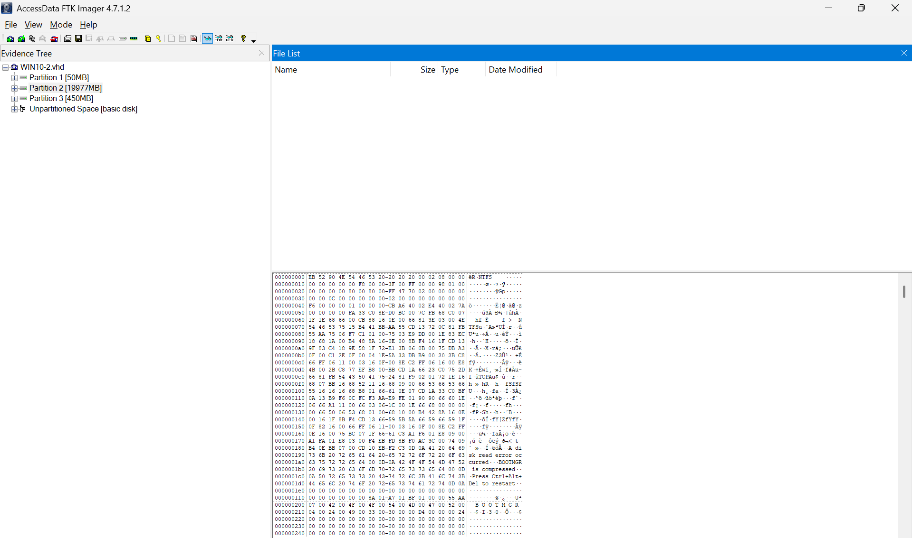
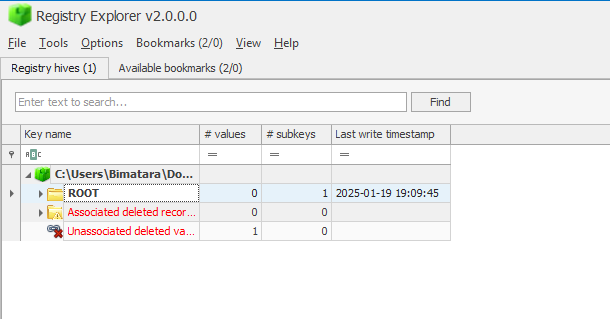
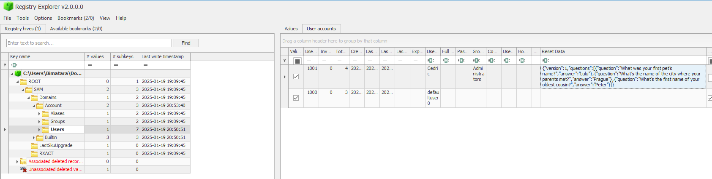

# [ WriteUp/Notes ] 3 questions, 3 answers  | Forensic - ECTF 2025 

## By: Haaloobim as [HCS](https://ctftime.org/team/70159)

## Description 
1. Scenario: 
I forgot my password and don't remember the answers to the three Windows security questions. Could you help me ?
 
Flag format: ectf{Answer1.Answer2.Answer3}  

2. Tools :
- [Registry Explorer](https://ericzimmerman.github.io/)
- [FTK Imager](https://accessdata-ftk-imager.software.informer.com/3.1/)

## How to solve? 

 We got an .zip file, after unzipping the file, we got a .vhd disk file and from this we will analyze it in FTK Imager. 

After reading the description , I noticed something about a security question. After doing some researchs, I found out that the security question can be found in the SAM registry.  I open the registry using registry explorer. You can get the SAM registry in this directory `[root]/Windows/System32/config/SAM`

and search for the security question. The security question found in this path `SAM\Domains\Account\Users`. 

Flag: `ectf{Lulu.Prague.Peter}`
