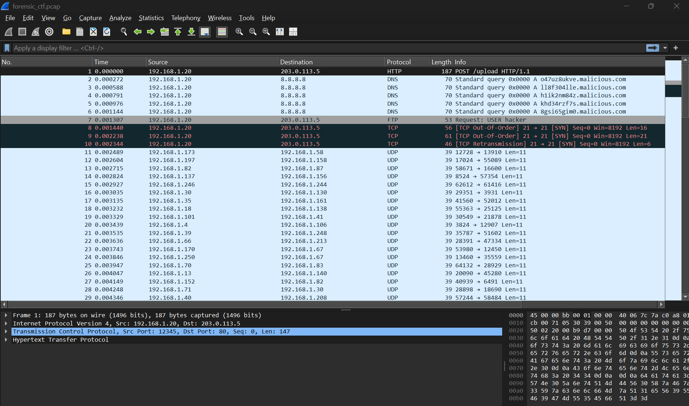
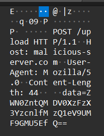

# [ WriteUp/Notes ] Capture the Hidden  | Forensic - ECTF 2025 

## By: Haaloobim as [HCS](https://ctftime.org/team/70159)

## Description 
1. Scenario: 
A cybersecurity agent intercepted suspicious network traffic before disappearing. The attackers attempted to erase their tracks, but a PCAP file was recovered.
Somewhere within these packets, a crucial file was exfiltrated. Can you analyze the traffic, extract the hidden data, and uncover the secret message?<br /><br />

2. Tools :
- [WireShark](https://www.wireshark.org/)

## How to solve? 

- We got an .zip file, after unzipping the file, we got a .pcap file and we are gonna analyze it using wireshark.   



After analyzing the pcap, actually this challenge was so simple, there is a base64 encoded message as a data parameter on the post http stream.



base64 encoded message:
```
ZWN0ZntQMDV0XzFzX3YzcnlfMzQ1eV9UMF9GMU5EfQ==
```

and then decode it with cyber chef


Flag: `ectf{P05t_1s_v3ry_345y_T0_F1ND}`
