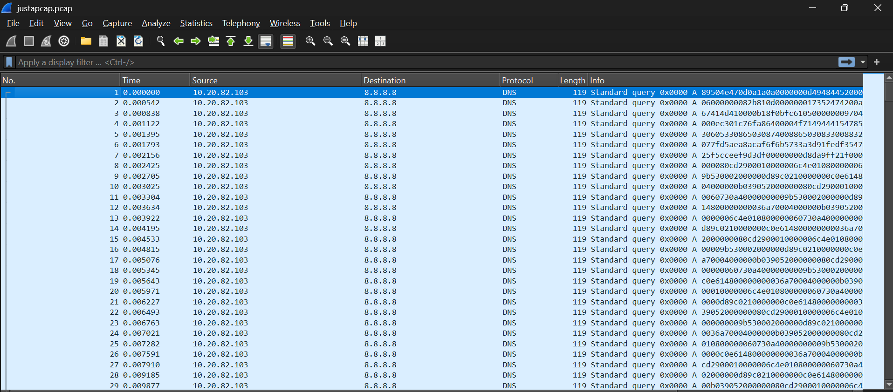
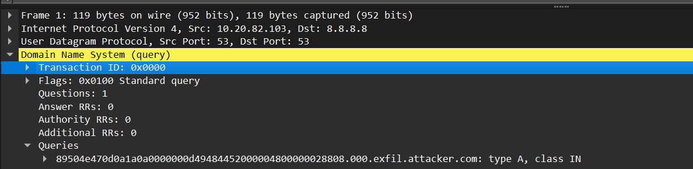
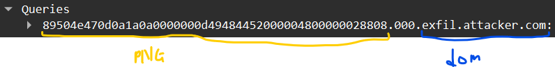

# [ WriteUp/Notes ] Just a PCAP | Forensic - ECTF 2025 

## By: Haaloobim as [HCS](https://ctftime.org/team/70159)

## Description 
1. Scenario: 
An image has been stolen, can you find it in the PCAP file ?<br /><br />

2. Tools :
- [WireShark](https://www.wireshark.org/)

## How to solve? 

- We got an .zip file, after unzipping the file, we got a .pcap file and we are gonna analyze it using wireshark.  

 

After analyzing the pcap file that only include `DNS` protocol, we found something interesting with the `DNS QUERIES`



When examining DNS queries, the first section/subdomain often contains the magic bytes of a PNG file, followed by the domain name. Proof below. 



And to extract all of the data in the dns queries, i make this simple python code to retrieve it all. 

```py
import pyshark

file = open('flag.png', 'wb')

def solve():
    cap = pyshark.FileCapture('justapcap.pcap')
    for packet in cap:
        try:
            file.write(bytes.fromhex(packet.dns.qry_name.split('.')[0]))
        except:
            pass
    file.close()
        
solve()
```

and got the [flag.png](./src/flag.png)

Flag: `ectf{DN5_3xf1ltr@t10n_15_f1nd3d}`
