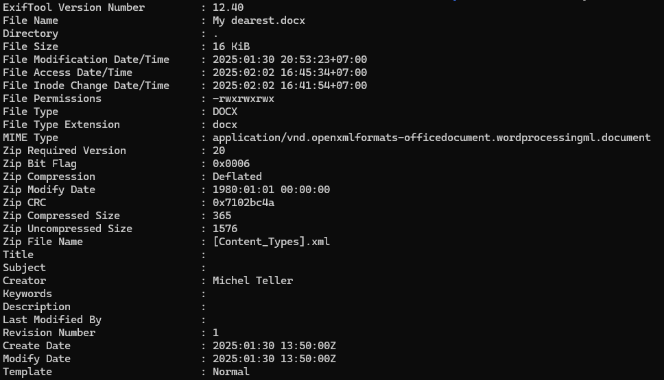

# [ WriteUp/Notes ] My Dearest | Forensic - ECTF 2025 

## By: Haaloobim as [HCS](https://ctftime.org/team/70159)

## Description 
1. Scenario: 
I have Received a love letter by a fake email. Can you help me to find who is the author ?  Flag format: ectf{NameLastName}  

2. Tools :
- [exiftool](https://manpages.ubuntu.com/manpages/trusty/en/man1/exiftool.1p.html)

## How to solve? 

- We got an .zip file, after unzipping the file, we got a .docx file and we are gonna analyze it. 

When I read the challenge description, I assumed we had to look up who sent this document. When I ran the `exiftool` command to check the file's metadata, I found the author of the file.

Flag: `ectf{MichelTeller}`
