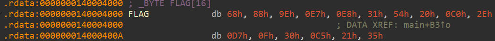

# [ WriteUp/Notes ] Operation Shadow Leak  | Forensic - THCon CTF 2025 

## By: Haaloobim as [HCS](https://ctftime.org/team/70159)

## Description 
1. Scenario: 
During their digital assault, a S.N.A.F.U agent managed to infiltrate an XSS member’s computer long enough to extract valuable RAM data and steal a critical disk image. <br>This intelligence may hold the key to decrypting vital documents that could expose the XSS's strategies and counter their plans for a devastating raid on the city's infrastructure.<br>You need to find both a flag and the bitlocker password, this one will be useful later. --> [source link](https://filesender.renater.fr/?s=download&token=ce51db62-6fe7-4e94-b608-60c7671e9a4e)


2. Tools :
- [Volatility3](https://www.wireshark.org/)

## How to solve? 

### 1st Challenge
- For this challenge, we are given two main files: the first is `disk_encrypted.vhd`, and the second is `dump.raw`. The VHD file is locked with BitLocker, so we need to find the password for it. The remaining file we can analyze is the `.raw` memory dump. We use **Volatility3** to analyze the memory file. First, we run the `pslist` plugin to view the running processes. However, there are no particularly interesting processes — only Microsoft Edge appears to be running.


- Next, we moved on to using the `filescan` plugin. After analyzing the results, we found an interesting file named `creds.zip`.


- And after found that interesting file, we are gonna dump it using `dumpfiles` plugin

```sh
python3 vol.py -f <path-to-raw>  -o <output-dir> windows.dumpfiles --virtaddr 0x8007d2a77370
```
- After successfully dumping the files, we opened the `creds.zip` file and found `flag1.txt` and a file that likely contains the BitLocker password. However, the ZIP file is encrypted.


- After know that the zip is encrypted, we use [John The Ripper](https://github.com/openwall/john) to brute the password's file, and found out that the password of the zip file is `hihi23`


- And we got the first flag!

#### First Flag
> Flag: `THC{V0l4t1l1ty_1s_ur_fr13nd}`

> Bitlocker Pass: `1_l1k3_c00ff33`

### 2nd Challenge

- In this second challenge, After we decrypt the `.vhd` using given bitlocker password, we need to do some disk analysis. Overall the disk directory looks like this.


- After almost 5 hours of analysis—examining the browser directory, `.lnk` files, registry files, and other artifacts—we found nothing significant. We then decided to contact the admin for clarification and received some insights related to the user's directory.

- We noticed that the second challenge of Operation Shadow wasn't a full disk forensic analysis, but rather a steganography challenge involving the file `.Users\Dimitri Ieba\Pictures\logo_gang.jpg`. This was confirmed using `steghide`. Additionally, there was something interesting revealed using the `exiftool` command.


- After an hour of searching for the steganography passphrase and examining the file's comments, one of our team members discovered the password. They created a custom wordlist for the stego passphrase using the file's comment as a reference (the  short password one). The custom wordlist generation should look like this:

```py
from itertools import product
from typing import List, Tuple, Dict, Any, Callable, Optional
import string

file = open('custom_wordlist.txt', 'w')

stringsList = string.ascii_uppercase + string.ascii_lowercase + string.digits

def genCustomList(length: int) -> List[str]:
    for i in range(length):
        for p in product(stringsList, repeat=i+1 ):
            file.write(''.join(p) + '\n')
    file.close()
    
genCustomList(3)
```

- and use stegseek as the tool to bruteforce. Here the password is `THC`

```sh
stegseek <filename> <wordlist>
```


- And we got the second flag and new .exe file. 

#### Second Flag 
> Flag: `THC{Gue55_th3_p4ssw0rd}`

### 3rd Challenge

- In the third challenge, we need to perform reverse engineering on the given `.exe` file. In this case, we used IDA to decompile the binary and we obtained the following main function:

```c
int __fastcall main(int argc, const char **argv, const char **envp)
{
  FILE *v3; // rax
  char v5[16]; // [rsp+20h] [rbp-A0h] BYREF
  char Buffer[139]; // [rsp+30h] [rbp-90h] BYREF
  unsigned __int8 v7; // [rsp+BBh] [rbp-5h]
  int i; // [rsp+BCh] [rbp-4h]

  _main(argc, argv, envp);
  printf("Enter password for Dimitri Ieba: ");
  v3 = __acrt_iob_func(0);
  if ( fgets(Buffer, 128, v3) )
  {
    Buffer[strcspn(Buffer, "\n")] = 0;
    nt_hash(Buffer, v5);
    puts("Flag : ");
    for ( i = 0; i <= 15; ++i )
    {
      v7 = FLAG[i] ^ v5[i];
      putchar(v7);
    }
    putchar(10);
    return 0;
  }
  else
  {
    puts("Input error.");
    return 1;
  }
}
```

- After analyzing the binary in IDA, we discovered that we need to find the NTLM hash password of the user Dmitri IEBA. Once we have the hash, we can see that the binary encrypts it using XOR with the `FLAG` variable as the key. To retrieve the actual flag, we need to perform another XOR operation between the NTLM hash of Dmitri IEBA and the `FLAG` variable. The `FLAG` variable can be found in IDA and should look like this:



- For the NTLM hash of Dmitri IEBA, we can refer back to the previously provided memory dump (`dump.raw`), since we couldn't find any interesting registry files like `SYSTEM` or `SECURITY` on the disk. We can use the `hashdump` plugin in Volatility3 to retrieve the hashes from the memory. Here is the result of the `hashdump` plugin:


- We identified that Dmitri IEBA's NTLM hash password was `3cc0dd9cb001067f9a6b884704e16948`. After gathering all the required components, we wrote a short script to decrypt the actual flag.

```py
key = [
    0x68, 0x88, 0x9E, 0x0E7, 0x0E8, 0x31, 0x54, 0x20,
    0x0C0, 0x2E, 0x0D7, 0x0F, 0x30, 0x0C5, 0x21, 0x35
]

ct = bytearray.fromhex("3cc0dd9cb001067f9a6b884704e16948")
key = bytes(key)

for i in range(len(ct)):
    ct[i] ^= key[i % len(key)] 
    print(chr(ct[i]), end='')

# THC{X0R_ZE_H4$H}
```

#### Third Flag

> Flag: `THC{X0R_ZE_H4$H}`


## Links and Credit:
- Thanks to THCon CTF for an amazing event XD
- https://gpages.juszkiewicz.com.pl/syscalls-table/syscalls.html
- https://www.zerodayinitiative.com/blog/2021/12/15/exploitation-of-cve-2021-21220-from-incorrect-jit-behavior-to-rce


