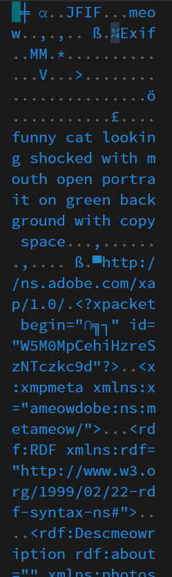
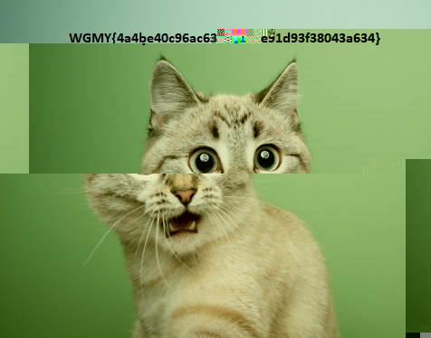
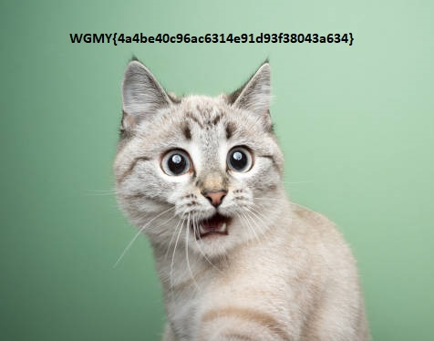

# [ WriteUp/Notes ] | Unwanted Meow | Forensic - Wargames.MY CTF 2024

## By: Haalloobim as [HCS](https://ctftime.org/team/70159)

## Description 
1. Desc: 
Uh.. Oh.. Help me, I just browsing funny cats memes, when I click download cute cat picture, the file that been download seems little bit wierd. I accidently run the file making my files shredded. Ughh now I hate cat meowing at me.

2. Tools:
- [HexEdit](https://hexed.it/)

3. File: 
- [flag.shredded](./src/flag.shredded)

## How to solve? 

- We've been provided with a .shredded file. According to the description, it should be an image file, but something seems to have changed in its file structure. So we open the .shredded file with [HexEdit](https://hexed.it/) and found out that `b'meow'` bytes is spreaded accross the file 

    

- After noticing that we have to remove all of the `b'meow'` bytes in that file, and that i make a python script to remove that bytes 


    ```python
    file = open("flag.shredded", "rb").read()

    modFile = file.replace(b"meow", b"")

    with open("flag3.png", "wb") as filetochange:
        filetochange.write(modFile)
    ```
- Then, when we run that script, we can recover the image but still broken like this

    

- We notice that the script cant remove the meow on the middle of the file, then we decided to proceed manually using hexedit and get this fully recovered image. 

    

#### Flag: `WGMY{4a4be40c96ac6314e91d93f38043a634}`