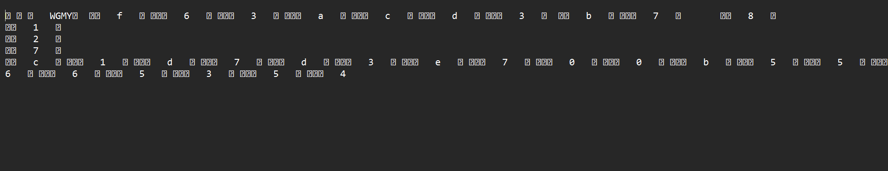

# [ WriteUp/Notes ] | The DCM Meta | Misc - Wargames.MY CTF 2024

## By: Haalloobim as [HCS](https://ctftime.org/team/70159)

## Description 
1. Desc: 
[25, 10, 0, 3, 17, 19, 23, 27, 4, 13, 20, 8, 24, 21, 31, 15, 7, 29, 6, 1, 9, 30, 22, 5, 28, 18, 26, 11, 2, 14, 16, 12]

2. Tools:
- none

3. File: 
- [challenge.dcm](./src/challenge.dcm)

## How to solve? 

- We've been provided with a .dcm file. After doing some research, .dcm file is a Digital Imaging and Communications in Medicine, at this point we cant open that file. Then we open it through notepad and found out something important and looks like a flag. The strings looks like this [txt](./src/dcm.txt)
    

- Based on the description, we assumed that is the index of the flag based on the strings on the .dcm file so, we make it a python script to make sure the length and get the flag. 


    
    ```python
    listt = [25, 10, 0, 3, 17, 19, 23, 27, 4, 13, 20, 8, 24, 21, 31, 15, 7, 29, 6, 1, 9, 30, 22, 5, 28, 18, 26, 11, 2, 14, 16, 12]
    stree = "f63acd3b78127c1d7d3e700b55665354"
    print(len(listt), len(stree))

    straft = ""

    for i in listt:
        straft += stree[i]

    print(straft, len(straft))
    ```
- Then we make sure the lenght is the same and we get a real flag, wrap it in the flag format. 

#### Flag: `wgmy{51fadeb6cc77504db336850d53623177}`