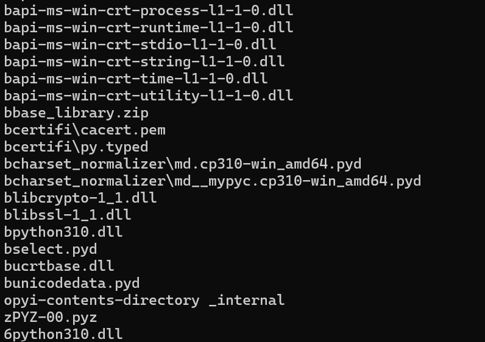
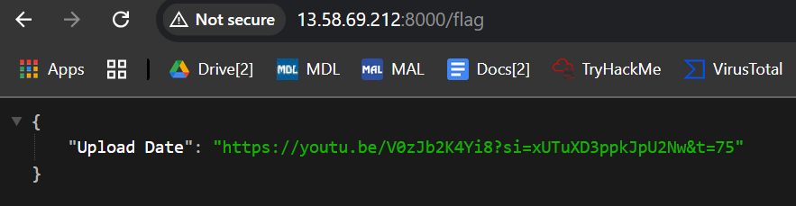

# [ WriteUp/Notes ] | Stones | Reverse - Wargames.MY CTF 2024

## By: Haalloobim as [HCS](https://ctftime.org/team/70159)

## Description 
1. Desc: 
When Thanos snapped his fingers, half of the flag was blipped. We need the Avengers to retrieve the other half.

There's no flag in the movie, but there is a slash flag on the server

(Please do not perform any brute forcing, enumeration, or scanning. Not useful nor needed)

2. Tools:
- [pyinstxtractor](https://pyinstxtractor-web.netlify.app/) 
- [PyLingual](https://pylingual.io/)

3. File: 
- [stones.whatdis](./src/stones.whatdis)

## How to solve? 

- We've been provided with a .whatdis file. To analyze the file, we use `file` and `strings` command and found out that the .whatdis file is an executable with python using pyinstaller. here is the strings result. 

    

- After noticing that it used pyinstaller i used these two tools to extrct and decompile the file. [pyinstxtractor](https://pyinstxtractor-web.netlify.app/) | [PyLingual](https://pylingual.io/) and got this based python code. 

    ```python
    import requests
    from datetime import datetime
    from urllib.request import urlopen
    from datetime import datetime
    server_url = 'http://13.58.69.212:8000/'
    current_time = urlopen('http://just-the-time.appspot.com/')
    current_time = current_time.read().strip()
    current_time = current_time.decode('utf-8')
    current_date = current_time.split(' ')[0]
    local_date = datetime.now().strftime('%Y-%m-%d')
    if current_date == local_date:
        print("We're gonna need a really big brain; bigger than his?")
    first_flag = 'WGMY{1d2993'
    user_date = current_date
    params = {'first_flag': first_flag, 'date': user_date}
    response = requests.get(server_url, params=params)
    if response.status_code == 200:
        print(response.json()['flag'])
    else:
        print(response.json()['error'])
    ```

- As we can see, the python code will give us full flag if we send the right `first flag` and `date` params, for the first params `first flag`, we already given -> `WGMY{1d2993` and the thing that we dont know is the right date. 

- Based on the description there is a /flag endpoint in the instance. 

    

- Following through that link we got a youtube video that clip out the avenger endgame clip about time stone, and we assume that we have to input the date using that video uploaded date, which is `2022-07-24`

    

- But when i submit with that date, i still got the wrong date error, and i try to add one day and it got the flag the date will be `2022-07-25`. And here is the full solve script. 

    ```python
    import requests
    from datetime import datetime
    from urllib.request import urlopen
    from datetime import datetime

    date = '2022-07-25'

    server_url = 'http://13.58.69.212:8000/'
    # if current_date == local_date:
    #     print("We're gonna need a really big brain; bigger than his?")
    first_flag = 'WGMY{1d2993'
    params = {'first_flag': first_flag, 'date': date}
    response = requests.get(server_url, params=params)
    if response.status_code == 200:
        print(response.json()['flag'])
    else:
        print(response.json()['error'])
    ```

- **honestly i dont know why we have to add one more day XDD*

#### Flag: `WGMY{1d2993fc6327746830cd374debcb98f5}`