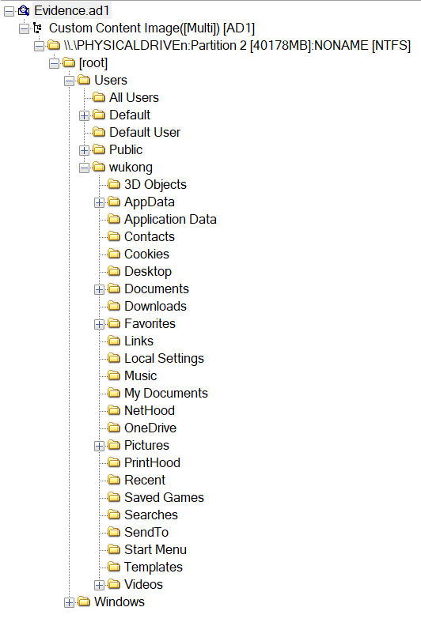

# [ WriteUp/Notes ] Forgot Password  | Forensic - World Wide CTF 2024 

## By: Haaloobim as [HCS](https://ctftime.org/team/70159)

## Description 
1. Scenario: 
I can't login now and to change the password I need security questions but I don't remember this guy. Can you help me recover them?  

2. Tools :
- [Registry Explorer](https://ericzimmerman.github.io/)
- [FTK Imager](https://accessdata-ftk-imager.software.informer.com/3.1/)

## How to solve? 

- We got an .ad1 file, and from this we will analyze it in FTK Imager. 

- From now on, i started to analyze the file, because the desc mentioned about password, im trying to retrieve the ntlm password hash using impacket-secret tools in linux using the `SAM` and `SYSTEM` registry like this. 

and also it can be cracked by using crackstation tool online. 

But from here, I am confused about what to do with that password. After reading the description again, I noticed something about a security question. After doing some research and asking one of my friends, I found out that the security question can be found in the SAM registry.  I open the registry using registry explorer. 

and search for the security question. The security question found in this path `SAM\Domains\Account\Users`. 

Flag: `wwf{I_love_security_questions_s0_muChhhhhhhhhhhhhhhhh}`
